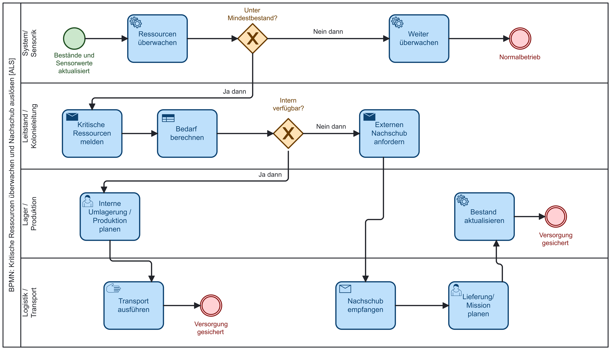

# AP11: BPMN-Modellierung

## Prozess 1: Kritische Ressourcen überwachen und Nachschub auslösen

## Ziel

Dieses Arbeitspaket beschreibt den Businessprozess „Kritische Ressourcen überwachen und Nachschub auslösen“ und bildet ihn als BPMN-Modell ab.

Der Prozess gehört zu den Hauptprozessen der Mars Logistik Verwaltung [ALS], weil Sauerstoff, Wasser, Nahrung und Ersatzteile für den Betrieb der Marskolonie kritisch sind.

Die Ausarbeitung orientiert sich am Feedback von Prof. Dr. Becking und konzentriert sich auf den reduzierten Projektfokus.

---

## Prozessbeschreibung

Der Prozess startet, wenn Bestände und Sensorwerte aktualisiert wurden.

Das System überwacht die Ressourcen und prüft, ob ein Mindestbestand unterschritten wurde.

Wenn kein Mindestbestand unterschritten wurde, läuft der Normalbetrieb weiter.

Wenn ein Mindestbestand unterschritten wurde, wird eine kritische Ressource gemeldet und der konkrete Bedarf berechnet.

Danach wird geprüft, ob die benötigte Ressource intern verfügbar ist.

Wenn die Ressource intern verfügbar ist, wird eine interne Umlagerung oder Produktion geplant und anschließend die Versorgung abgesichert.

Wenn die Ressource nicht intern verfügbar ist, wird externer Nachschub angefordert. Danach wird der Nachschub empfangen und der Bestand aktualisiert.

Der Prozess endet, sobald die Versorgung gesichert ist.

---

## Beteiligte Bereiche

| Bereich | Aufgabe |
|---|---|
| System / Sensorik | Bestände überwachen und Sensorwerte auswerten |
| Leitstand / Kolonieleitung | Kritische Ressourcen bewerten und Bedarf berechnen |
| Lager / Produktion | Interne Umlagerung oder Produktion planen |
| Logistik / Ausführung | Interne Umlagerung oder externe Lieferung organisatorisch abwickeln |

---

## Zentrale Entscheidungen

| Entscheidung | Ergebnis |
|---|---|
| Unter Mindestbestand? | Ja: Bedarf wird bearbeitet. Nein: Normalbetrieb |
| Intern verfügbar? | Ja: interne Lösung. Nein: externer Nachschub |

---

## Bezug zur Datenbank

Der Prozess kann durch SQL-Abfragen und Stored Procedures unterstützt werden.

Relevante Datenbankaufgaben:

| Aufgabe | Zweck |
|---|---|
| Ressourcenbestand prüfen | aktuelle Bestände auslesen |
| Mindestbestand vergleichen | kritische Ressourcen erkennen |
| Bedarf berechnen | fehlende Menge bestimmen |
| interne Verfügbarkeit prüfen | Lager oder Produktion auswerten |
| Bestand aktualisieren | neue Werte speichern |

---

## Bezug zur Webanwendung

Die Webanwendung kann den Prozess über ein Ressourcen-Dashboard sichtbar machen.

Mögliche Anzeigen:

| Anzeige | Nutzen |
|---|---|
| aktuelle Bestände | Überblick |
| kritische Ressourcen | Warnung |
| Nachschubbedarf | Entscheidungsgrundlage |
| Nachschubstatus | Kontrolle |
| aktualisierte Bestände | Prüfung der Versorgung |

---

## Ergebnis

Das BPMN-Modell zeigt, wie kritische Ressourcen erkannt, bewertet und durch interne oder externe Maßnahmen abgesichert werden.

Der Prozess ist fachlich sinnvoll, wirtschaftlich relevant und gut für eine datenbankgestützte Umsetzung geeignet.

---

## Offene Punkte

| Punkt | Status |
|---|---|
| Feedback von Prof. Dr. Becking einarbeiten | in Bearbeitung |
| SQL-Abfragen konkret zuordnen | offen |
| Stored Procedures planen | offen |
| BPMN-Modell final prüfen | offen |
| BPMN-Grafik in Projektdokumentation einfügen | vorbereitet |

---

## Dauer

Dauer: 1,5 Tage

Hinweis: AP11 ist in zwei BPMN-Dateien aufgeteilt. Zusammen ergeben Prozess 1 und Prozess 2 einen Gesamtaufwand von 3 Tagen.
